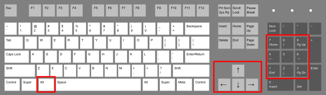

# Terminator Notes

My config for Terminator

## Path
`~/.config/terminator/config`
* You'll need to make a first modification into Terminator parameters to have the config file automatically created

## Shortcuts

These shortcuts use the ALT key + another one:
* Arrow keys: Move to another terminal
* Numpad 1 7: Zoom out/in
* Numpad 9: New terminal on right
* Numpad 3: New terminal on bottom
* Numpad 5: Toggle zoom
* Numpad 2 4 6 8: Resize current terminal

## Notes
I like having `paste` command using the right click.  
To display the menu, do a middle click.